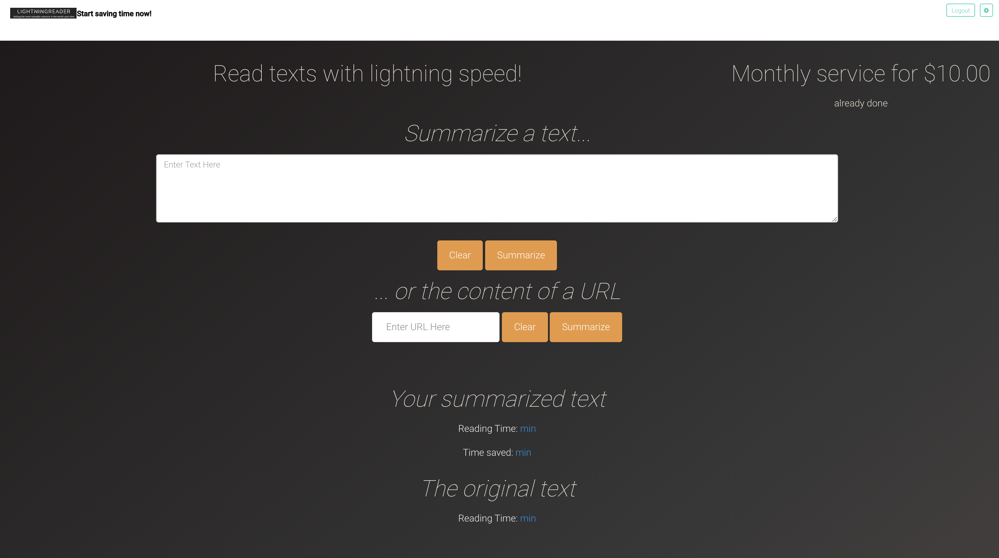
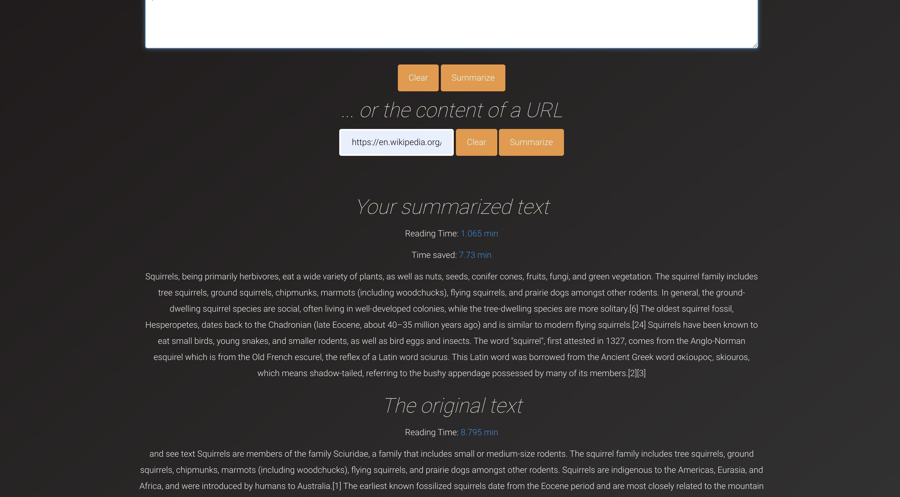

# LightningReader
Webapp for automatic text and url summarization.

### About

Given a piece of text or a url, this [Flask](https://flask.palletsprojects.com/en/1.1.x/)
app will summarize the text/ the content located
at the url using the [spacy](https://spacy.io) python package to automatically summarize
any given text or content of a url. Urls are read using `urlopen` and the text
is extracted using `BeautifulSoup`.

Currently this only works for texts in English. Other languages can be added very easily, though, see below.

### Running the app locally

The app structure is based on the [Flaskex](https://github.com/anfederico/Flaskex) flask boilerplate. If you want to try out the app locally, you need to export your stripe-keys as environment variables. To do that, locate your stripe secret key and your stripe publishable key in your respective Stripe account. Then, on the command line, run

```
$ export STRIPE_SECRET_KEY=your_secret_key
$ export STRIPE_PUBLISHABLE_KEY=your_publishable_key
```

Then, clone this repository:

````
$ git clone https://github.com/stefan-stein/LightningReader.git
````

Navigate into the newly cloned repository and install the required libraries:

```
$ cd lightningreader
$ pip install -r requirements.txt
```

Run the app!

```
$ python app.py
```

Note that if you are using test keys from stripe, you can use one of their [test credit cards](https://stripe.com/docs/testing) to access the app after signing up (all sign ups are stored locally on your machine, so don't worry).

### Changing the language

The spacy](https://spacy.io) python package uses *language modules* that need
to be installed separately. A list of the available modules and installation
instructions can be found [here](https://spacy.io/usage/models). The general syntax
for installing a new language model is

```
$ python -m spacy download MODULE_NAME
```

After downloading the module, you need to tell the app that you want to use it
instead of the English language module. For that, find the `app.py` file located
in the root directory. In line 8 of that file, the language module that is
used in the summarization is imported. Change that line to use the newly downloaded
module instead:

```
nlp = spacy.load('MODULE_NAME')
```

### Demo screenshots

This is what the app looks like after succsessful login:



Here we summarized the Wikipedia page on squirrels:




Enjoy!
